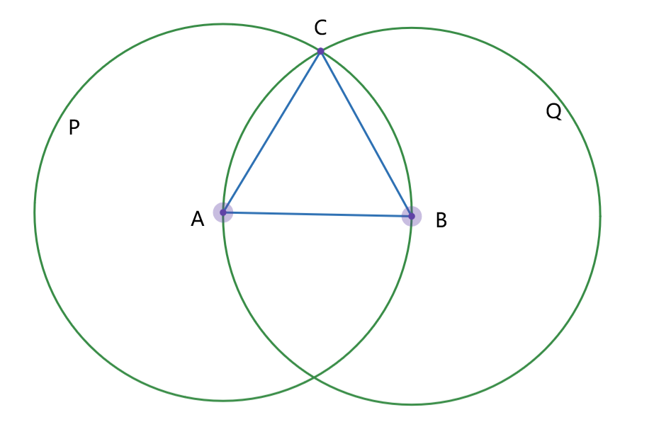

*版权声明* © Copyright 2024 Boyer.
作者：Boyer 审稿：Lizer, Squareroot_2.

# Taller and Higher

&emsp;&emsp;数学绝不仅仅是算术.

## 前言
&emsp;&emsp;很高兴遇到你，你眼神中对知识的渴望也坚定了我学习的道路，同时也看到了我的一些过去，所以我决定为你开设这个关于数学世界的系列。我把这个系列起名为 Taller and Higher， 目的是为了提升你的数学高度和视野，曾经我接触过一本高中竞赛数学书，书名是《更高更妙》，里面集结了许多用竞赛方法解决高考数学题的例子，不过我们这个系列最重要的是开阔视野，也就是说最重要的是“高度”和“境界”，许多做题技巧是讲究“巧妙”的，但这不是我们的主题，这也是我吧这个系列叫做 Taller and Higher 的原因 —— 陷于题海久了，不妨让我们登上高山，遨游天空，从更高的视角俯视已经学过的一切。

&emsp;&emsp;也许未来我会把这个系列出成一本书来启发更多孩子吧，谁知道呢？

## Lesson 0 Review——回顾
&emsp;&emsp;先来大致的回顾一下上次我们讲了什么：
* 数学的一些基本术语：定义、命题、公理、证明、定理、……
* 有理数之外 —— 无理数
  1. 有没有一个数，自己乘自己等于$2$？这个数是有理数吗？
  2. 小学接触过的第一个无理数：$\pi$。$\pi$是怎么来的？圆的面积为什么是$\pi r^{2}$
* 代数式 —— 形式化的开始
  1. $(a+b)^2 = a^2 + 2ab + b^2$
* 函数 —— 功能
  1. 什么是函数
  2. 平面直角坐标系（笛卡尔坐标系，Cartesian Coordinate System）
  3. 直线与一次函数以及它的方程

&emsp;&emsp;上述内容就是上次见面所提及的内容，不过由于时间较为紧张，所以许多细节都快速带过了，现在我们可以分成多次娓娓道来了。

&emsp;&emsp;在第一节开始之前，我们来统一的进行一些约定。

&emsp;&emsp;首先是编号，可以看到本节是Lesson 0， 下一节是Lesson 1，每一节中涉及的命题、定理等等，如果没有特殊引用，我们会以这一节的序号作为开头，一个小数点后是这个命题或者定理等的编号，在下一节我们就会看到。这样如果我提到以前提过的命题或是定理等，就可以直接使用编号来查找。

&emsp;&emsp;其次是代数式的一些约定。之前我们已经简单接触过代数式了，就是用一些字母、符号代替数字进行运算，以此来研究所有数字之间的运算规律。代数式在乘法上会省略乘号，这样在很多时候会方便观察，有时乘号 $\times$ 会使用点乘符号 $\cdot $ 代替 。注意，数字间的计算还是要好好写乘号 $\times$ 的。
&emsp;&emsp;例如：设整数 $a, b$，那么：
$$
a \times b = a \cdot b = ab
$$

## Lesson 1 数学系统的开端 —— 最基本的数学语言
&emsp;&emsp;数学是一个奇妙的世界，这个世界上有着无数的建筑，数学的每一个分支都是数学世界的一座建筑物 —— 几何学、代数学、分析学、逻辑学…… 有些建筑是根基性的，比如数理逻辑、集合论等，这些根基性的学科定义了数学最基本的事物，比如什么是数，什么是加法，什么是减法等等，其他更高的建筑就在这根基之上发展。
&emsp;&emsp;我们平时更像是在数学世界的地面，非常自然走在数学世界的根基已经给我们修缮好的道路上：基本的加减乘除，列方程，计算面积，但是地面之下的根基却也博大精深，它保证了你所使用的一切都是稳固的，正如你吧两个正数加起来一定不会得到负数一样。这个问题是多么的显然，加起来当然越来越多，可是为什么？这就像秩序一样无法打破，无论如何他都是对的。没错，这样的根基就是秩序。
&emsp;&emsp;路面之上有很多形形色色的建筑，有的很高很陡峭，也有的没那么高，大多数人都能登的上。例如你即将接触到的代数式、函数、初等平面几何，这些初中知识，这些并不很陡峭，在如此稳固的根基之上十分自然的就构建出来了，后面我们也会慢慢升高，逐一探讨。

&emsp;&emsp;作为开始，我们不急着勇攀高峰，先简略的看看路面之下的根基是怎么样的，我们介绍一些数学的基本名词：定义、命题、公理、证明、定理。

### 定义
&emsp;&emsp;定义，用于说明一些事物是什么。更准确的说，是满足某些条件的事物。例如我们如下定义偶数和奇数：

**定义1.1**（偶数）：能被$2$整除的整数。
**定义1.2**（奇数）：不能被$2$整除的整数。

&emsp;&emsp;根据定义我们可以清楚的知道如$0, 2, 4, 6, ...$这样的数是偶数，而$1, 3, 5, 7, ...$这样的数是奇数。

&emsp;&emsp;我们再给出一些更为常用的定义：

**定义1.3**（有理数）：一个数，如果能被表达为两个整数的比，则其为有理数。即，若：
$$
q = {a \over b}
$$
&emsp;&emsp;且$a, b$都是整数$(b \neq 0)$，那么$q$是一个有理数。

**定义1.4**（有理数的乘法）：设两个有理数$p, q$满足：
$$
p = {a \over b}, \space
q = {c \over d}
$$
&emsp;&emsp;那么：
$$
pq = {a\over b}\cdot{c\over d}={ac \over bd}
$$
### 命题
&emsp;&emsp;命题，是用于判断真假的陈述句。不光数学，在哲学上也是，数学家和哲学加们往往讨论一件事情是对的还是错的，是真的还是假的，那么我们就把讨论的问题称为**命题**。
&emsp;&emsp;数学上，一个命题要么是真的，要么是假的，不可能既真又假。所以，如果我们讨论的命题是真的，我们称其为**真命题**，否则(也就是这个命题是假的，不成立的)称为**假命题**。
&emsp;&emsp;例如：
**命题1.1**：太阳每天会升起。
**命题1.2**：晚上的时候能看见太阳。
**命题1.3**：火星上存在生命。

&emsp;&emsp;我们给出了三个命题，如果我们以日常生活的常识为基础，可以容易的辨认出命题1.1是真命题以及命题1.2是假命题。对于命题1.3，它可能是真的，也可能是假的，目前我们无法得知。

<!-- 

 -->

### 公理
&emsp;&emsp;公理，是默认为真的命题。公理是数学世界的真正的基石，深深埋藏于数学世界的最深的地心之中，许多公理十分的简洁，但这些简单的公理却成为了数学世界的根基，使得数学世界蓬勃发展。
&emsp;&emsp;在这里我简单的展示欧几里得公理系统。其中**公设**的本意与**公理**并没有什么区别，只是**公设**的描述对象是**几何体**，即图形。而**公理**的描述对象是**代数**，可以简单理解为一些大小关系。
&emsp;&emsp;这里只是将欧几里得公理系统作为介绍，目前还不必深入理解这些公理的内涵，我们将在初中学习几何时第一次正式接触他们。在这里介绍它，只是为了展示一个系统的根基。《几何原本》，欧几里得在古希腊时期构建的一个硕大数学系统 —— 是一个包含13卷书共465个命题的数学体系。

*欧几里得公理系统*
&emsp;&emsp;**公设1.1**：两点可以确定一条直线。
&emsp;&emsp;**公设1.2**：直线可以沿其正反两个方向无限延长。
&emsp;&emsp;**公设1.3**：在平面内，所有与某一定点的距离相等的点可构成一个圆。
&emsp;&emsp;**公设1.4**：凡直角都相等。
&emsp;&emsp;**公设1.5**：同一平面内一条直线和另外两条直线相交，若在这条直线同侧的两个内角之和小于180°，则另外两条直线一定相交。

&emsp;&emsp;**公理1.1**：等于同量的量彼此相等。
&emsp;&emsp;**公理1.2**：相等的量加某一量，其和仍相等。
&emsp;&emsp;**公理1.3**：相等的量减某一量，其差仍相等。
&emsp;&emsp;**公理1.4**：彼此能够重合的几何图形是全等的。
&emsp;&emsp;**公理1.5**：整体大于部分。

&emsp;&emsp;仅仅10条公理，却构建出如此大厦，这正是公理作为根基所具有的厚重的力量。

### 证明
&emsp;&emsp;证明，就是通过逻辑过程说明一个命题是真的或者是假的的过程。数学上的证明是十分严谨的，数学世界的一座座大厦都是通过“证明”而搭建起来的，比如下面给出一个证明的过程。

**命题1.4**： $100$是偶数。
&emsp;**证明**:
$$
\because 100 = 50 \times 2\\
\therefore 100 \div 2 = 50 \cdots \space \cdots 0
$$&emsp;&emsp;根据**定义1.1**，$100$是偶数。 

$\square$

&emsp;&emsp;其中用到了几个证明中常用的数学符号：因为 $\because$  所以 $\therefore$ 这两个符号能直接体现证明的逻辑过程，从因为到所以的过程之间需要依赖一些理论依据，这些依据是一些真命题，比如上述证明过程之中用到的真命题为： **乘法和除法互为逆运算** 。结尾的正方形 $\square$ 是证毕符，表示一个证明的结束，证明结束前，会给出我们要证明的命题结果是真的还是假的。
&emsp;&emsp;个人而言，证毕符是我最喜欢的符号，因为对于许多精妙或者重要的命题，当证明结束写下证毕符的那一刻，总是最美好的一刻。

### 定理
&emsp;&emsp;定理，是一些真命题。不是所有真命题都适合作为定理，定理的作用是服务于证明，因为证明过程中的每一步逻辑推理都需要理论依据，这里的依据来源于一些真命题，有一些真命题在证明过程中经常被用到，于是称之为定理，所以可以理解定理为“方便用于证明的一些真命题”。
&emsp;&emsp;值得一提的是，有一些定理被称为“**引理**”，一般情况下，引理是用来证明一些更加强的定理的。
&emsp;&emsp;下面给出了几个小学已经学过的定理（尽管那时候并不知道这是一条定理）：

**定理1.1**(整数乘法的交换律)：设$a, b$是两个整数，那么：
$$
a\times b = b \times a
$$

**定理1.2**(整数乘法的结合律)：设$a, b, c$是两个整数，那么：
$$
(a\times b) \times c = a \times (b \times c)
$$

&emsp;&emsp;很早以前就已经学过乘法交换律了，包括加法交换律，这些都是非常显然的事情。但是定理都是需要证明的，他们的根基都基于公理，对于定理1.1我们在此处不做证明，证明过程依赖的理论基础比较深奥。我们暂且认为这个定理是正确的，我们可以由此定理证明其他的命题，例如：

**定理1.3**(有理数乘法的交换律)：设$p, q$是两个有理数，那么：
$$
p\times q = p \times q
$$

&emsp;**证明：**
&emsp;&emsp;设$p, q$是两个有理数，由**定义1.3**，存在整数$a, b, c, d$满足：
$$
p = {a \over b}, \space
q = {c \over d}, \space 
b \neq 0, d \neq 0
$$
&emsp;&emsp;由**定义1.4**得：
$$
pq = {a\over b}\cdot{c\over d}={ac \over bd} \tag{1}
$$
&emsp;&emsp;因为$a, b, c, d$都是整数，于是由**定理1.1**得：
$$
{ac \over bd}={ca \over db}\tag{2}
$$
&emsp;&emsp;再次由**定义1.4**得：
$$
{ca \over db} = {c\over d}\cdot{a\over b} = qp\tag{3}
$$
&emsp;&emsp;由上面三个式子$(1),(2),(3)$可以得到：
$$
pq = qp
$$

$\square$

&emsp;&emsp;上面的证明过程好似在说废话，因为每一步都很显然，但其实每一步都是对已有定义或者定理的使用而不是无中生有或者随意变化，并且说明了有理数和整数是完全不同的概念。整数满足乘法交换律那么有理数就一定满足乘法交换律吗？为什么？上面的证明就给出了答案：有理数的乘法交换律不是天然就存在的，其根本源于有理数的定义(**定义1.3**)，有理数乘法的定义(**定义1.4**)以及整数的乘法交换律(**定理1.1**)。

&emsp;&emsp;事实上，在许多代数系统中，交换律是不成立的！本文最后的阅读材料就给出了这样的一个例子。所以呢，**定理**就显得十分重要。因为有理数中的乘法交换律是一个被正确证明的定理，所以我们日常生活中的计算就可以放心大胆的交换啦！

### 本节回顾
&emsp;&emsp;本节主要讲解了几个数学的基本术语：定义、命题、公理、证明、定理，也举了非常多的例子，窥探了广大数学世界的一角。在之后的游览数学世界的道路上，会频繁的接触和使用这些名词，这些也是数学世界语言最基础的名词，相信掌握这门“语言”后，能够更加深入的放眼数学世界。

## 思考习题
&emsp;&emsp;**不同于作业，这不是作业**，这个习题作用在于引导思考，**贵在思考**，所以可能会有**一定的难度**，在毫无思绪时可以翻看后一页的参考答案，只要思考并理解了，那么你得思维就升华了。

**习题1.1**：证明命题：53是奇数。

**习题1.2**：证明：有理数满足乘法结合律。

**习题1.3**：根据欧几里得公理系统提供的公设和公理，证明《几何原本》的第一条命题：
&emsp;**《几何原本》第一卷 几何基础**
&emsp;**命题I.1：** 已知一条线段，可以作一个等边三角形。`（等边三角形的三条边长度相同。）`

## 参考资料

### 1. 习题参考答案

**习题1.1**：证明命题：53是奇数。

&emsp;**证明**:
$$
\because 53 = 26 \times 2 + 1\\
\therefore 53 \div 2 = 26 \cdots \space \cdots 1 \neq0
$$&emsp;&emsp;根据**定义1.2**，53是奇数。

$\square$

**习题1.2**：证明：有理数满足乘法结合律。
&emsp;**证明**:
&emsp;&emsp;设$p, q, r$是三个有理数，由**定义1.3**，存在整数$a, b, c, d, f, g$满足：
$$
p = {a \over b}, \space
q = {c \over d}, \space 
r = {f \over g}, \space 
b \neq 0, d \neq 0, g \neq 0
$$
&emsp;&emsp;由**定义1.4**得：
$$
(pq)r = ({a\over b}\cdot{c\over d})\cdot{f\over g}={ac \over bd}\cdot {f\over g} ={(ac)f \over (bd)g}\tag{4}
$$
&emsp;&emsp;注意，上述$(4)$式中的两次变化是两次分别应用**定义1.4**的结果，第二步可以应用**定义1.4**是因为$a, c$是整数，于是$ac$是整数，因为$b, d$是非零整数，于是$bd$是非零整数，于是${ac \over bd}$是有理数，于是才能应用**定义1.4**。

&emsp;&emsp;因为$a, b, c, d, f, g$都是整数，于是由**定理1.2**得：
$$
{(ac)f \over (bd)g}={a(cf) \over b(dg)}\tag{5}
$$
&emsp;&emsp;再次由**定义1.4**得：
$$
{a(cf) \over b(dg)} = {a\over b}\cdot{cf\over dg} ={a\over b}\cdot({c\over d}\cdot {f \over g})  = p(qr)\tag{6}
$$
&emsp;&emsp;由上面三个式子$(4),(5),(6)$可以得到：
$$
(pq)r = p(qr)
$$

$\square$

**习题1.3**：根据欧几里得公理系统提供的公设和公理，证明《几何原本》的第一条命题：
&emsp;**《几何原本》第一卷 几何基础**
&emsp;**命题I.1：** 已知一条线段，可以作一个等边三角形。`（等边三角形的三条边长度相同。）`

&emsp;**证明**:
&emsp;&emsp;设已知的线段$AB$.
&emsp;&emsp;根据**公设1.3**，以$A$为圆心，$AB$为半径可作一圆，记为圆$P$.
&emsp;&emsp;根据**公设1.3**，以$B$为圆心，$AB$为半径可作一圆，记为圆$Q$.
&emsp;&emsp;任取圆$P$和圆$Q$的一个交点为$C$.
&emsp;&emsp;根据**公设1.1**，可作直线$AC$.
&emsp;&emsp;根据**公设1.1**，可作直线$BC$.

  

&emsp;&emsp;根据**公设1.3**，$AC=AB$.
&emsp;&emsp;根据**公设1.3**，$BC=AB$.
&emsp;&emsp;根据**公理1.1**，$AC=AB=BC$.
&emsp;&emsp;于是 $ \triangle ABC $即为所求.

$\square$

### 2. 阅读材料 —— 矩阵与矩阵乘法
&emsp;&emsp;原本这一部分被放在了**定理**的正文和习题之中作为例子，但是在笔者和众审稿的多次讨论和研究后认为此时引入矩阵有些不合时宜，于是将其作为阅读材料，**仅作阅读参考使用，暂时不要求掌握**。以它为例子的目的是为了表明**定理的重要性**，说明直觉并不能作为真命题使用，还需**通过证明来证实**人产生的猜想。

#### 2.1 不符合交换律的乘法 —— 矩阵乘法

&emsp;&emsp;事实上，整数的乘法系统中，交换律是非常自然而且显然的，但是数学的世界并不是这样。例如在 *线性代数* 的 *矩阵乘法系统* 里，乘法交换律就并不成立。
&emsp;&emsp;下面给出了一个矩阵乘法不满足交换律的例子：

设二维矩阵$A, B$分别为：

$$
A =
\begin{bmatrix}
1 & 2 \\
0 & 0
\end{bmatrix},  
B = 
\begin{bmatrix}
1 & 0 \\
2 & 0
\end{bmatrix}  
$$
那么
$$
A \times B =
\begin{bmatrix}
1 & 2 \\
0 & 0
\end{bmatrix} \times
\begin{bmatrix}
1 & 0 \\
2 & 0
\end{bmatrix} =
\begin{bmatrix}
5 & 0 \\
0 & 0
\end{bmatrix} \\\space\\
B \times A =
\begin{bmatrix}
1 & 0 \\
2 & 0
\end{bmatrix} \times
\begin{bmatrix}
1 & 2 \\
0 & 0
\end{bmatrix} =
\begin{bmatrix}
1 & 2 \\
2 & 4
\end{bmatrix}
$$
&emsp;&emsp;可以看到交换$A$和$B$，他们的乘法结果完全不同! 这是由矩阵乘法的运算法则决定的，对于矩阵乘法是如何运算的，你能找到规律吗？

#### 2.2 矩阵乘法法则
&emsp;&emsp;设二维矩阵$A, B$分别为：

$$
A =
\begin{bmatrix}
a_{11} & a_{12} \\
a_{21} & a_{22}
\end{bmatrix},  
B = 
\begin{bmatrix}
b_{11} & b_{12} \\
b_{21} & b_{22}
\end{bmatrix}  
$$
&emsp;&emsp;那么：
$$
A \times B =
\begin{bmatrix}
a_{11} & a_{12} \\
a_{21} & a_{22}
\end{bmatrix} \times  
\begin{bmatrix}
b_{11} & b_{12} \\
b_{21} & b_{22}
\end{bmatrix}  =
\begin{bmatrix}
a_{11}b_{11}+a_{12}b_{21} & a_{11}b_{12}+a_{12}b_{22}\\ 
a_{21}b_{11}+a_{22}b_{21} & a_{21}b_{12}+a_{22}b_{22}\\ 
\end{bmatrix}
$$
&emsp;&emsp;``注：字母间的乘法符号已省略``
&emsp;&emsp;其中的具体运算规则为$A$对应的行和$B$对应的列单独拿出来，对齐后各元素相乘，最后相加，具体像如下：

$$
\begin{bmatrix}
\boxed{a_{11}} & \boxed{a_{12}} \\
a_{21} & a_{22}
\end{bmatrix} \times  
\begin{bmatrix}
\boxed{b_{11}} & b_{12} \\
\boxed{b_{21}} & b_{22}
\end{bmatrix}  =
\begin{bmatrix}
\boxed{a_{11}b_{11}+a_{12}b_{21}} & \space \\ 
\space & \space \space \space \space\space\space\space\space\space\space\space\space\space\space\space\space\space\space\space\space\space\space\space\space\\ 
\end{bmatrix}
$$

$$
\begin{bmatrix}
\boxed{a_{11}} & \boxed{a_{12}} \\
a_{21} & a_{22}
\end{bmatrix} \times  
\begin{bmatrix}
b_{11} & \boxed{b_{12}} \\
b_{21} & \boxed{b_{22}}
\end{bmatrix}  =
\begin{bmatrix}
a_{11}b_{11}+a_{12}b_{21} & \boxed{a_{11}b_{12}+a_{12}b_{22}}\\ 
\\ 
\end{bmatrix}
$$

$$
\begin{bmatrix}
a_{11} & a_{12} \\
\boxed{a_{21}} & \boxed{a_{22}}
\end{bmatrix} \times  
\begin{bmatrix}
\boxed{b_{11}} & b_{12} \\
\boxed{b_{21}} & b_{22}
\end{bmatrix}  =
\begin{bmatrix}
a_{11}b_{11}+a_{12}b_{21} & a_{11}b_{12}+a_{12}b_{22}\\ 
\boxed{a_{21}b_{11}+a_{22}b_{21}} \\ 
\end{bmatrix}
$$

$$
\begin{bmatrix}
a_{11} & a_{12} \\
\boxed{a_{21}} & \boxed{a_{22}}
\end{bmatrix} \times  
\begin{bmatrix}
b_{11} & \boxed{b_{12}} \\
b_{21} & \boxed{b_{22}}
\end{bmatrix}  =
\begin{bmatrix}
a_{11}b_{11}+a_{12}b_{21} & a_{11}b_{12}+a_{12}b_{22}\\ 
a_{21}b_{11}+a_{22}b_{21} & \boxed{a_{21}b_{12}+a_{22}b_{22}}\\ 
\end{bmatrix}
$$

&emsp;&emsp;可以拿出草稿纸自己写写算算。

#### 2.3 矩阵乘法的结合率

&emsp;&emsp;虽然矩阵乘法不满足交换律，但是它满足结合律，下面我们给出它满足结合律的证明，证明过程的理论依据也比较简单，即**矩阵乘法法则、乘法分配律，加法交换律**。这里的所说的乘法分配律和加法交换律可以是整数的、有理数的以及未来将会学到的实数的乘法分配律和加法交换律。

&emsp;&emsp;证明二维矩阵的乘法运算满足结合律，即证：

&emsp;&emsp;设矩阵$A, B, C$分别为：

$$
A =
\begin{bmatrix}
a_{11} & a_{12} \\
a_{21} & a_{22}
\end{bmatrix},  
B = 
\begin{bmatrix}
b_{11} & b_{12} \\
b_{21} & b_{22}
\end{bmatrix},  
C = 
\begin{bmatrix}
c_{11} & c_{12} \\
c_{21} & c_{22}
\end{bmatrix}  
$$
&emsp;&emsp;尝试证明：
$$
(A \times B) \times C =A \times (B \times C)
$$

&emsp;&emsp;**首先不要惧怕，后面的证明过程看似很庞大很复杂，但每一步都是简单的一步变化。**

&emsp;**证明**:
&emsp;&emsp;应用**矩阵乘法法则**和一般的**乘法分配律**，我们先求等式左侧$ (A \times B) \times C $的结果：

$$
(A \times B )\times C=
\bigg(
\begin{bmatrix}
a_{11} & a_{12} \\
a_{21} & a_{22}
\end{bmatrix} \times
\begin{bmatrix}
b_{11} & b_{12} \\
b_{21} & b_{22}
\end{bmatrix} 
\bigg)
\times
\begin{bmatrix}
c_{11} & c_{12} \\
c_{21} & c_{22}
\end{bmatrix}
\\ 
\space 
\\= 
\begin{bmatrix}
a_{11}b_{11}+a_{12}b_{21} & a_{11}b_{12}+a_{12}b_{22}\\ 
a_{21}b_{11}+a_{22}b_{21} & a_{21}b_{12}+a_{22}b_{22}\\ 
\end{bmatrix} 
\times
\begin{bmatrix}
c_{11} & c_{12} \\
c_{21} & c_{22}
\end{bmatrix} 
\\ 
\space 
\\= 
\begin{bmatrix}
(a_{11}b_{11}+a_{12}b_{21})c_{11}+ (a_{11}b_{12}+a_{12}b_{22})c_{21} & (a_{11}b_{11}+a_{12}b_{21})c_{12}+ (a_{11}b_{12}+a_{12}b_{22})c_{22}\\ 
(a_{21}b_{11}+a_{22}b_{21})c_{11}+ (a_{21}b_{12}+a_{22}b_{22})c_{21} & (a_{21}b_{11}+a_{22}b_{21})c_{12}+ (a_{21}b_{12}+a_{22}b_{22})c_{22}\\ 
\end{bmatrix}  
\\ 
\space 
\\= 
\begin{bmatrix}
a_{11}b_{11}c_{11}+a_{12}b_{21}c_{11}+ a_{11}b_{12}c_{21}+a_{12}b_{22}c_{21} & a_{11}b_{11}c_{12}+a_{12}b_{21}c_{12}+ a_{11}b_{12}c_{22}+a_{12}b_{22}c_{22}\\ 
a_{21}b_{11}c_{11}+a_{22}b_{21}c_{11}+ a_{21}b_{12}c_{21}+a_{22}b_{22}c_{21} & a_{21}b_{11}c_{12}+a_{22}b_{21}c_{12}+ a_{21}b_{12}c_{22}+a_{22}b_{22}c_{22}\\ 
\end{bmatrix} 
$$
&emsp;&emsp;类似地，我们求等式右侧$ A \times (B \times C) $的结果：

$$
A \times (B \times C)=
\begin{bmatrix}
a_{11} & a_{12} \\
a_{21} & a_{22}
\end{bmatrix} \times
\bigg(
\begin{bmatrix}
b_{11} & b_{12} \\
b_{21} & b_{22}
\end{bmatrix} 
\times
\begin{bmatrix}
c_{11} & c_{12} \\
c_{21} & c_{22}
\end{bmatrix}
\bigg)
\\ 
\space 
\\= 
\begin{bmatrix}
a_{11} & a_{12} \\
a_{21} & a_{22}
\end{bmatrix} \times
\begin{bmatrix}
b_{11}c_{11}+b_{12}c_{21} & b_{11}c_{12}+b_{12}c_{22}\\ 
b_{21}c_{11}+b_{22}c_{21} & b_{21}c_{12}+b_{22}c_{22}\\ 
\end{bmatrix} 
\\ 
\space 
\\= 
\begin{bmatrix}
a_{11}(b_{11}c_{11}+b_{12}c_{21})+a_{12}(b_{21}c_{11}+b_{22}c_{21}) & a_{11}(b_{11}c_{12}+b_{12}c_{22})+a_{12}(b_{21}c_{12}+b_{22}c_{22})\\ 
a_{21}(b_{11}c_{11}+b_{12}c_{21})+a_{22}(b_{21}c_{11}+b_{22}c_{21}) & a_{21}(b_{11}c_{12}+b_{12}c_{22})+a_{22}(b_{21}c_{12}+b_{22}c_{22})\\ 
\end{bmatrix}  
\\ 
\space 
\\= 
\begin{bmatrix}
a_{11}b_{11}c_{11}+a_{11}b_{12}c_{21}+a_{12}b_{21}c_{11}+a_{12}b_{22}c_{21} & a_{11}b_{11}c_{12}+a_{11}b_{12}c_{22}+a_{12}b_{21}c_{12}+a_{12}b_{22}c_{22}\\ 
a_{21}b_{11}c_{11}+a_{21}b_{12}c_{21}+a_{22}b_{21}c_{11}+a_{22}b_{22}c_{21} & a_{21}b_{11}c_{12}+a_{21}b_{12}c_{22}+a_{22}b_{21}c_{12}+a_{22}b_{22}c_{22}\\ 
\end{bmatrix} 
$$

&emsp;&emsp;最后，我们应用**加法交换律**，得到原式左右两边的计算结果是相等的：
$$
(A \times B) \times C=
\\ \space \\
\begin{bmatrix}
a_{11}b_{11}c_{11}+\boxed{a_{12}b_{21}c_{11}+ a_{11}b_{12}c_{21}} +a_{12}b_{22}c_{21} & a_{11}b_{11}c_{12}+\boxed{a_{12}b_{21}c_{12}+ a_{11}b_{12}c_{22}}+a_{12}b_{22}c_{22}\\ 
a_{21}b_{11}c_{11}+\boxed{a_{22}b_{21}c_{11}+ a_{21}b_{12}c_{21}}+a_{22}b_{22}c_{21} & a_{21}b_{11}c_{12}+\boxed{a_{22}b_{21}c_{12}+ a_{21}b_{12}c_{22}}+a_{22}b_{22}c_{22}\\ 
\end{bmatrix} 
\\ \space \\ = \\ \space \\
\begin{bmatrix}
a_{11}b_{11}c_{11}+\boxed{a_{11}b_{12}c_{21}+a_{12}b_{21}c_{11}}+a_{12}b_{22}c_{21} & a_{11}b_{11}c_{12}+\boxed{a_{11}b_{12}c_{22}+a_{12}b_{21}c_{12}}+a_{12}b_{22}c_{22}\\ 
a_{21}b_{11}c_{11}+\boxed{a_{21}b_{12}c_{21}+a_{22}b_{21}c_{11}}+a_{22}b_{22}c_{21} & a_{21}b_{11}c_{12}+\boxed{a_{21}b_{12}c_{22}+a_{22}b_{21}c_{12}}+a_{22}b_{22}c_{22}\\ 
\end{bmatrix} 
\\ \space \\=
A \times (B \times C)
$$

$\square$

### 3. 本节内容相关资料

[1] 有关几何的部分：《几何原本》
[2] 有关矩阵的部分：《线性代数》
[3] 有关命题，证明的论证逻辑部分：《数理逻辑》
[4] 有关数字本身的定义：《集合论》
[5] 有关运算性质的部分，如交换律、结合律、分配律等：《代数系统》
[6] 有关整数性质的部分：《数论》

  
  
  
  
  
  
  
  
  
  

 
*版权声明* © Copyright 2024 Boyer.

<!--  本节需要荧光笔标注的地方有如下几处
- 1 习题1.3答案的交换律部分
- 2 矩阵乘法规则的行列对应部分

-->